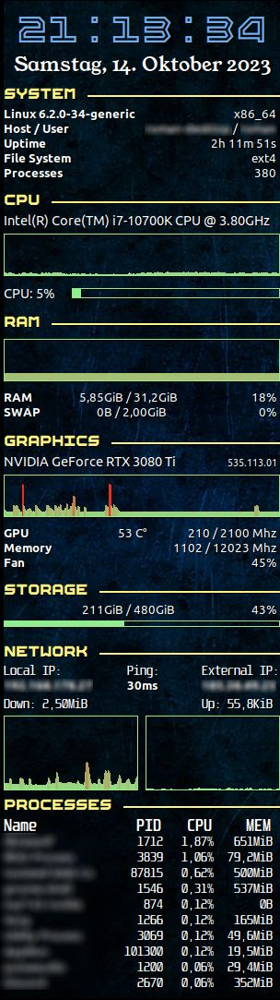

My personal .conkyrc for Nvidia graphics cards.  

This is a slight modification of the standard .conkyrc. 
It's optimized for a 2nd monitor, with a resolution of 1920x1080.  

### Installation
Download the latest release zip file and unzip it to a directory of your choice and run install.sh. This will create a symlink as ~/.conkyrc.  

### Required adjustments
Most likely you need to replace the correct network adapter for displaying the download and upload rate for your system. 
Open a terminal and enter the command <i>ip a</i> 
Copy the name of the correct adapter and replace all "enp0s31f6" in lines 87 and 88 with it  

Probably you also have to adjust the scaling of the upload and download graph 
Currently it is adjusted to my system, that means the maximum of the graphs are 110Mbit/s down and 31Mbit/s up.  

First calculate your maximum transfer rates for upload and download in bytes per second:  

For example, with a maximum transfer rate of 110MBit/s: 
110MBit/s / 8 = 13.75Mb/s 
13.75Mb/s * 1048576 = 14417920 b/s (1 megabyte = 1024*1024 bytes)  

In line 88 you replace the number as the 6th parameter of the objects downspeedgraph and upspeedgraph.  

### Assets
** Background **
<a href="https://www.freepik.com/free-photo/empty-dark-concrete-wall-room-studio-background-floor-perspective-with-blue-soft-light-displays_31367949.htm">Image by benzoix</a> on Freepik  

** Fonts **
- <a href="https://www.1001freefonts.com/unispace.font">Unispace</a> 
- <a href="https://www.1001fonts.com/ep-boxi-font.html">EP Boxi</a>  

### Screenshots
  

   

If you like the watchface, you can support me at 
[Paypal](https://paypal.me/RomanDrechsel) or [Buy me a coffee](https://www.buymeacoffee.com/romandrechsel)