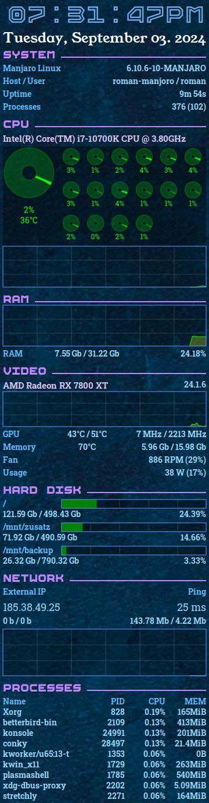

My personal .conkyrc for AMD Radeon graphics cards. 
I use it on Manjaro KDE.  

It only uses some core functions of conky, the visuals are mostly selfmade in LUA with cairo.  
It's optimized for a 2nd monitor, with a resolution of 2560x1440.  

### Installation
Clone the repository run <a href="https://github.com/RomanDrechsel/.conkyrc/blob/main/Anxiety/install.sh">install.sh</a> in the Anxiety folder. This will create a symlink as ~/.conkyrc.  
You can adjust some settings in the <a href="https://github.com/RomanDrechsel/.conkyrc/blob/main/Anxiety/config.lua">config.lua</a>  

### Requirements
You need to have the packages lm-sensors and sysstat installed.

### Assets
**Background** 
<a href="https://www.freepik.com/free-photo/empty-dark-concrete-wall-room-studio-background-floor-perspective-with-blue-soft-light-displays_31367949.htm">Image by benzoix</a> on Freepik 

**Fonts** 
<a href="https://www.1001freefonts.com/unispace.font">Unispace</a> 
<a href="https://www.1001fonts.com/ep-boxi-font.html">EP Boxi</a>  

### Screenshots
  

   

If you like it, you can support me on: 
[Paypal](https://paypal.me/RomanDrechsel) or [Buy me a coffee](https://www.buymeacoffee.com/romandrechsel)
